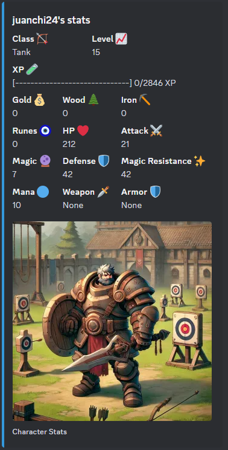
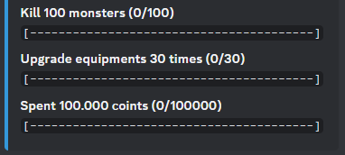
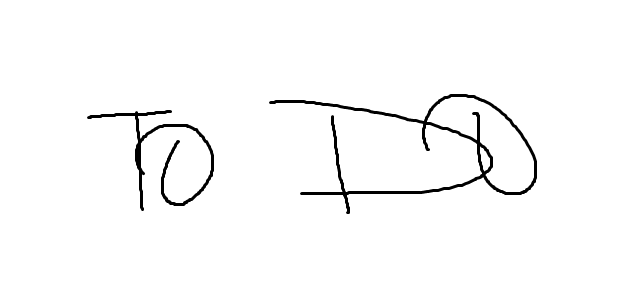

# Commands

## Index
- [Stats](#stats)
- [Combat](#combat)
- [Zones](#zones)

## Stats
Stats related commands.

### /stats
Shows the active hero stats, resources and equipment equiped.

### /advancements
Shows the hero advancemets.

## Combat
Fight related commands.

### /fight
Starts a fight in the current area.

### /dungeon
Starts a dungeon in the current area.
Dungeons are a series of fights followed by a boss fight and without the oportunity to heal.

### /raid
Waits for another player/players to join and fight against a very strong boss.

### /pvp
Waits for another player to acept and starts a player vs player fight.

## Zones
Zones related commands.

### /zone
Shows data of the actual zone, including the enemies seen.

