# Commands

## /help
Help command with important information.

| 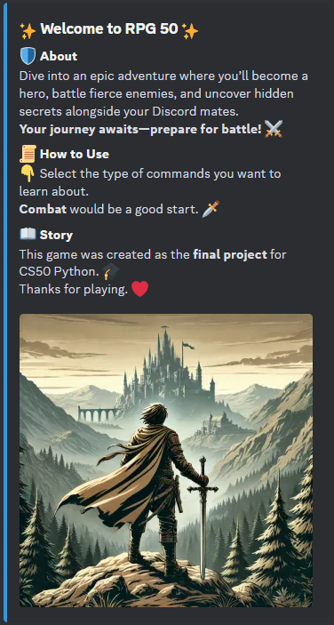 | 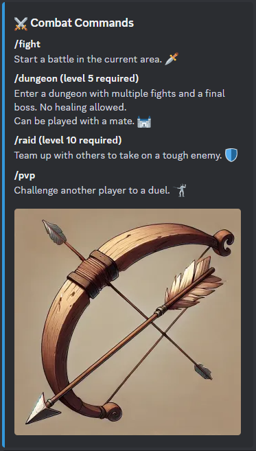 |
|------------------------------------|--------------------------------------|

## Index
- [Stats](#stats)
- [Combat](#combat)
- [Zones](#zones)
- [Equipment](#equipment)
- [Heroes](#heroes)
- [Commerce](#commerce)

## Stats
Stats related commands.

### /stats
Shows the active hero stats, resources, equipment equiped and abilities information.

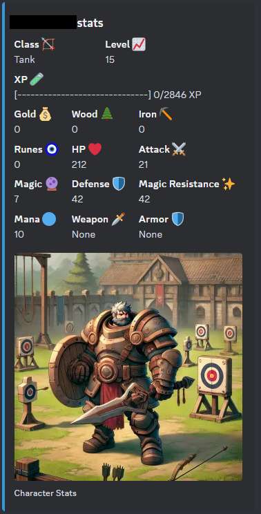

### /advancements
Shows the hero advancemets.

### /dex
Shows data about enemies seen.

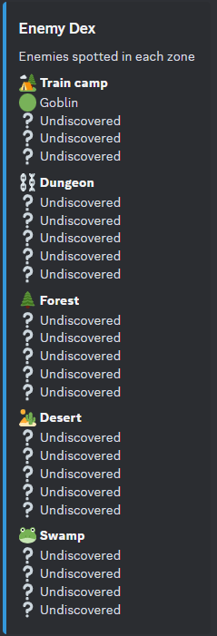

## Combat
Fight related commands.

### /fight
Starts a fight in the current area.

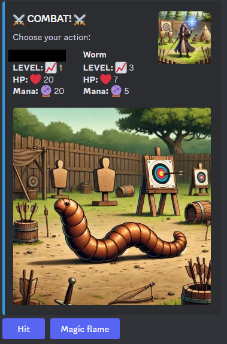

### /dungeon
Starts a dungeon in the current area.
Dungeons are a series of fights followed by a boss fight and without the oportunity to heal.
Can be done in companion with another user.
Level 5 required.

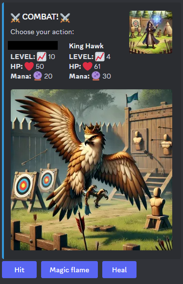

### /raid
Waits for another player/players to join and fight against a very strong enemy.
Level 10 required.

### /pvp
Waits for another player to acept and starts a player vs player fight.

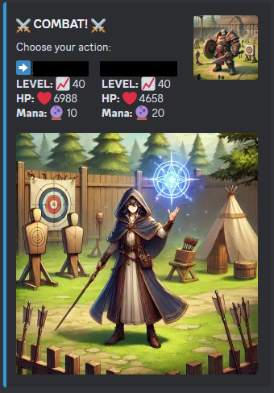

## Zones
Zones related commands.

### /zone
Shows data of the actual zone, including the enemies seen.

### /change_zone
Allows the user to change the actual zone depending on the user level.

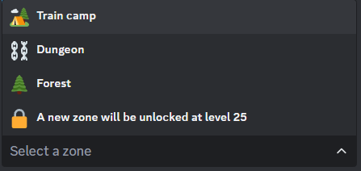

## Equipment
Equipment related commands.

### /equip_weapon
Allows the user to equip an adquired weapon.

### /equip_armor
Allows the user to equip an adquired armor.

| 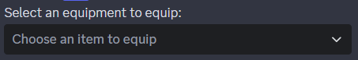 |  |
|------------------------------------|--------------------------------------|

### /forge
Opens the forge, equipment can be upgraded here.

### /inventory
Shows all equipment adquired and its stats.

## Heroes
Character related commands.

### /new_hero
If possible, allows the user to create a new hero. A new hero is possible to create when achiving level 20 with the actual one.

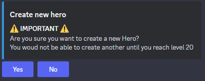
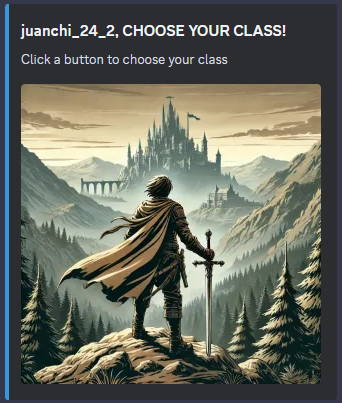

### /change_hero
Allows the user to change the actual hero.

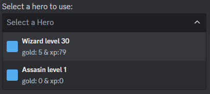

## Commerce
Commerce related commands.

### /shop
Shows the in game shop.

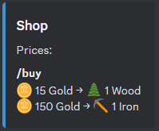

### /buy [item] [amount]
Buys an item from the shop.

### /trade [give_item] [give_amount] [receive_item] [receive_amount]
Waits for another player to acept the trade.

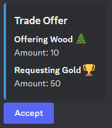