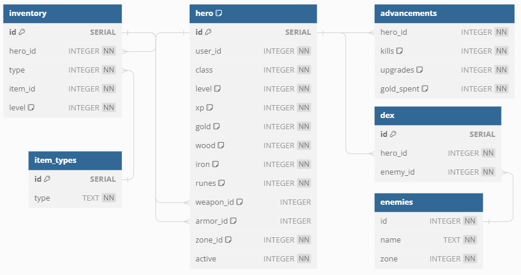

# Database

## Schema

### Index
- [Hero](#hero)

### Hero
The hero table plays the role of the "users" table. Contains information related to a specific hero and its differencited the hero ID with the user ID because each user can have more than 1 hero.
No stats such as, hp, attack, defense are saved because they are actomatically calculated after using a command using the hero level.
- **class**: Represents the internal id of the class of the hero.
- **weapon_id**/**armor_id**: Represents the equiped wich is equiped in this moment.
- **zone_id**: Represents the internal id of the zone the hero is in.
- **active**: Boolean value that represents the hero the user is using.

### Inventory & Item_types
Stores data about the equipment each hero has. "Type" column differenciate weapons from armors, allowing each type of item to be indexed individually.
- **hero_id**: ID of the hero owner of the equipment.
- **type**: ID of the Item_types table, represents the item type.
- **item_id**: Internal ID of the equipment
- **level**: Actual level of the equipment

### Advancements
Tracks the progresion across some parameters, such as, kills or upgrades.

### Dex & Enemies
Tracks the enemies seen by the hero. The "Enemies" table stores data about each enemy and the "Dex" table refers the enemy with its ID. The "Enemies" table is not updated while using the bot.
