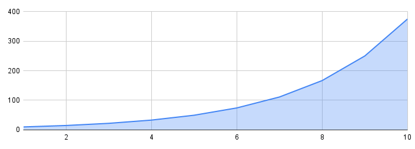
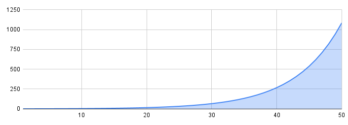
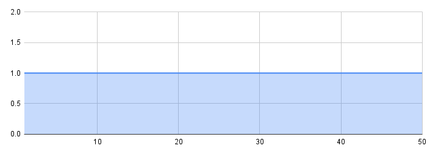
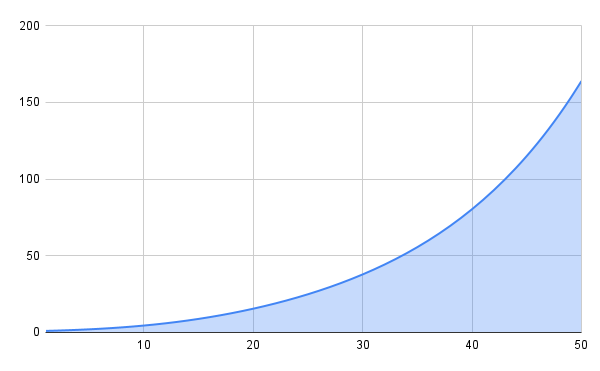

# Logic and Formulas

## Hero experience needed
Experience needed to level up scale exponentialy after each level.

### Experience needed scale formula
$$6.5 \times (1.5 ^ {\text{Hero Level}})$$

### Explanation
Each level xp needed is 50% more than the level before, starting from 10xp in level 1.

## Hero stats scale
All hero stats scale exponencialy except the mana.

### Stats scale formula
- Health
- Attack
- Defense
- Magic
- Magic resistance

$$Base Stat \times (1.15 ^ {\text{Hero Level}})$$

- Mana

$$Base Stat \times 1$$

#### Arguments
- **BaseStat**: Depends on each class.
- **Hero Level**: Current level of the hero.

### Explanation
Exponential stats grow makes that the difference beetween level 45-50 bigger than 20-25, rewarding the increase of xp needed on each level and helping to balance low level difference (making it not really important) and high level difference (making it harder to fight higher level enemies).
Mana stays the same because habilities mana cost never increase.

## Damage calculation (Normal attack)
Formula used when realising attacks that used the "Attack" stat (E.g.: "Hit").

### Damage calculation formula
$$
\left( \frac{Hero \ Attack^{1.5} \times Power}{Hero \ Attack + Enemy \ Defense + 10} \right) \times R \times C
$$

#### Arguments
- **Hero Attack**: Attack stat from the owner of the attack.
- **Enemy Degense**: Defense of the target of the attack.
- **Power**: Power of the attack, default is 10, some weapon attacks change it.
- **R**: Range beetween 0.8 and 1. Makes each attack random and inconsistance to resamble rpg random fight type.
- **C**: Crit chance (1/20) to double the damage.

### Explanation
Making the damage scale exponential at equal damage and defense compensates Healt exponential grow.