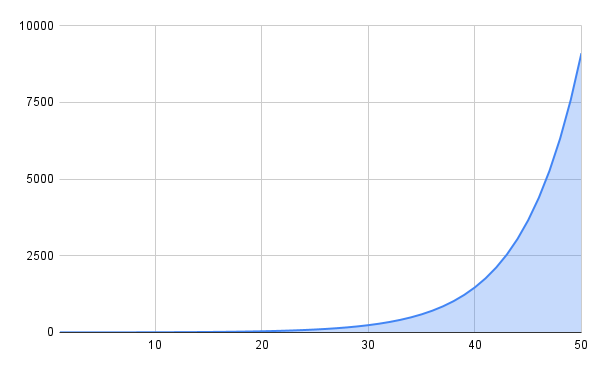
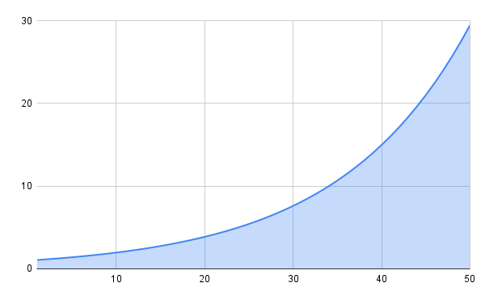
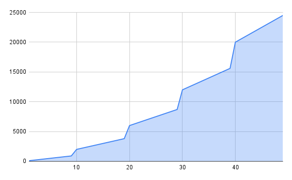
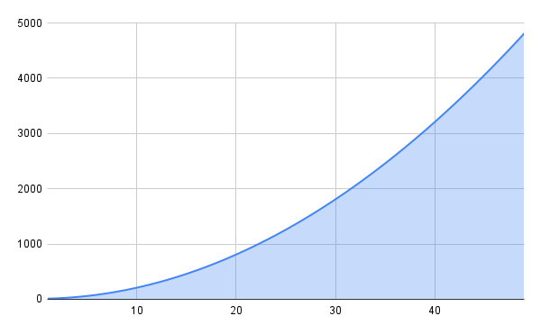
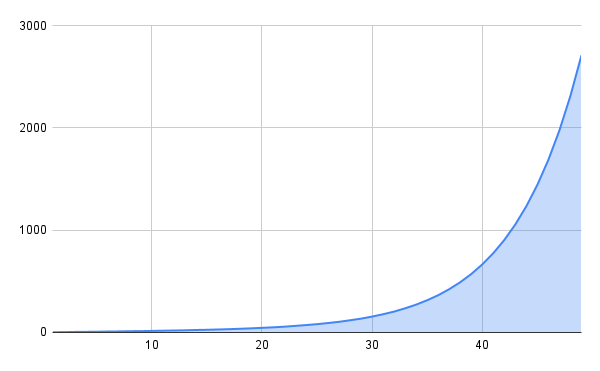
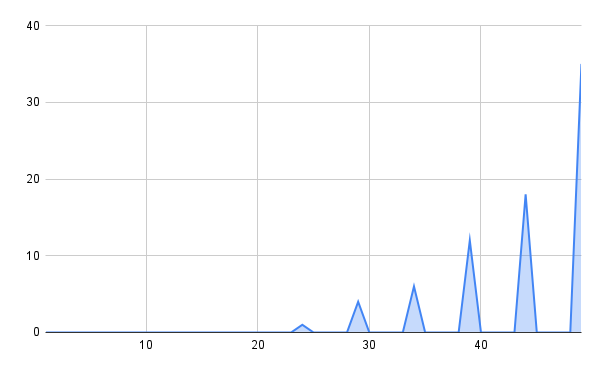
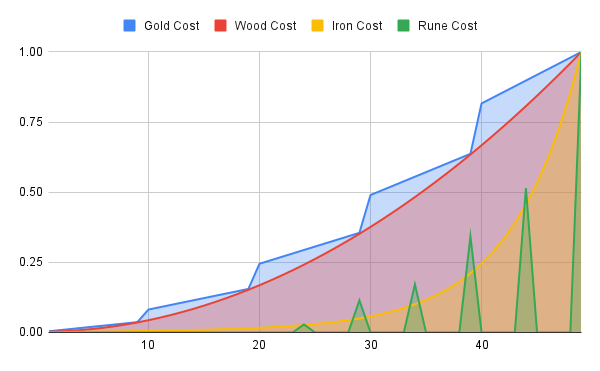

# Logic and Formulas

## Hero experience needed
Experience needed to level up scale exponentialy after each level. (50 is the max level)

### Experience needed scale formula
$$6.5 \times (1.5 ^ {\text{Hero Level}})$$

### Explanation
Each level xp needed is 50% more than the level before, starting from 10xp in level 1.

## Hero stats scale
All hero stats scale exponencialy except the mana.

### Stats scale formula
- Health
- Attack
- Defense
- Magic
- Magic resistance

$$Base Stat \times (1.15 ^ {\text{Hero Level}})$$

- Mana

$$Base Stat \times 1$$

#### Arguments
- **BaseStat**: Depends on each class.
- **Hero Level**: Current level of the hero.

### Explanation
Exponential stats grow makes that the difference beetween level 45-50 bigger than 20-25, rewarding the increase of xp needed on each level and helping to balance low level difference (making it not really important) and high level difference (making it harder to fight higher level enemies).
Mana stays the same because habilities mana cost never increase.

## Damage calculation
Formula used when realising attacks(E.g.: "Hit").

### Damage calculation formula
$$
\left( \frac{Hero \ Attack^{1.5} \times Power}{Hero \ Attack + Enemy \ Defense + 10} \right) \times R \times C
$$

#### Arguments
- **Hero Attack**: Attack/Magic stat from the owner of the attack.
- **Enemy Degense**: Defense/Magic resistance of the target of the attack.
- **Power**: Power of the attack, default is 10, some weapon attacks change it.
- **R**: Range beetween 0.8 and 1. Makes each attack random and inconsistance to resamble rpg random fight type.
- **C**: Crit chance (1/20) to double the damage (Magic attacks do not have crit chance).

### Explanation
Making the damage scale exponential at equal damage and defense compensates Healt exponential grow.

## Equipment stats calculation
The way in which the statistics are calculated together with the equipments.

### How its calculated
First the stats base in the level, then the weapon stats and last the armor stats.

$$
\text{Normal Stat} \quad \rightarrow \quad \text{Weapon stats} \quad \rightarrow \quad \text{Armor stats}
$$

Equipment boost are plain and multi. First the plain ones are added and then the multi ones.

$$
\text{Weapon plain boost} \quad \rightarrow \quad \text{Weapon multi boost} \quad \rightarrow \quad \text{Armor plain boost } \quad \rightarrow \quad \text{Armor multi boost}
$$ 

The next operations are done with each stat with each equipment.

$$
NewHeroStat = HeroStat + EquipmentPlainBoost
$$

$$
NewHeroStat = HeroStat * EquipmentMultiBoost
$$

### Explanation
After the boost from the weapon the stat boosted will be used with the armor, so exponential boosts are more efective in armors. This is to balance the fact that weapons had a custom attack.

## Equipment stats scale
The way equipment stats are calculated, there is no diference in how the plain and multi boosts scale.

### Max level
Equipments are divided in 5 ranks (1 to 5 stars). Max level is calculated with this formula:

$$
MaxLevel = Rank \times 10
$$

### Stats formula
The stats are calculated with this exponential formula:

$$
Boost \times {1.2} ^ {(level - 1)}
$$

### Explanation
**Level - 1** makes it that when the equipment is level 1 the boost multiplies itself by 1, so the final stats are the base stats.

## Enemy experience drop scale
Experience gained from defeating enemies scale.

### Experience formula
$$
BaseXP \times 1.07 ^ {EnemyLevel}
$$

#### Arguments
- **BaseXP**: Base xp given by an enemy, it is different for each one.

### Explanation
This exponential grow makes it more rewarding to fight higher level enemies, but it grows slower than the xp needed to level up. Making it that, more monsters are needed to be beaten to level up each time.

## Equipment drop rate
Each enemy may have an equipment drop rate, the probability of getting it after defeating the enemy depends on each one, but for the majority the odds are around 5% - 10%.
Heros have a limit of 1 for each type of equipment. So, when you already have the equipment an enemy drops, it would not drop it again.

## Equipment upgrade costs
The costs of upgrading equipments scale exponentialy. There is no difference beetween the price of upgrades beetween diferent equipment ranks, except for the runes (Low rank equipment does not need them). This means that upgrading to level 15, cost the same for all equipments.
each upgrade requires gold, wood, iron and for multiplies of 5 from level 25, runes.

### Formulas

#### Gold
$$
\text{UpgradeCost} = CurrentLevel \times \left(100 \times \left( \left\lfloor \frac{CurrentLevel}{10} \right\rfloor + 1 \right)\right)
$$

##### Arguments
- **CurrentLevel**: Level of the equipment.
- **\( \left\lfloor \frac{\text{CurrentLevel}}{10} \right\rfloor \)**: Integer division to obtain the ten of the curret level.

##### Explanation
After each level the amount required will increase by 100, after level 10 by 200, after level 20 by 300, and so on.

#### Wood
$$
\text{UpgradeCost} = 10 + \left(CurrentLevel^2 \times 2\right)
$$

#### Iron
$$
\text{UpgradeCost} = CurrentLevel + 5^{(CurrentLevel \times 0.1)}
$$

#### Runes
When the equipment rank is 4 or 5 the costs are:
- **To level 25**: 1
- **To level 30**: 4
- **To level 35**: 6
- **To level 40**: 12
- **To level 45**: 18
- **To level 50**: 35

#### Explanation
Gold scale makes it level more difficult than the before but without a very high jump.
Wood scale higher in lower levels and less in higher levels than iron, making this las resource more valuable over time.
Runes are a rare resource and only used in high level equipment and in low cuantities.

### Costs table

| Actual level | Gold Cost | Wood Cost | Iron Cost | Rune Cost |
|-------|-----------|-----------|-----------|------------|
| 1     | 100       | 12        | 2         | 0          |
| 2     | 200       | 18        | 3         | 0          |
| 3     | 300       | 28        | 5         | 0          |
| 4     | 400       | 42        | 6         | 0          |
| 5     | 500       | 60        | 7         | 0          |
| 6     | 600       | 82        | 9         | 0          |
| 7     | 700       | 108       | 10        | 0          |
| 8     | 800       | 138       | 12        | 0          |
| 9     | 900       | 172       | 13        | 0          |
| 10    | 2000      | 210       | 15        | 0          |
| 11    | 2200      | 252       | 17        | 0          |
| 12    | 2400      | 298       | 19        | 0          |
| 13    | 2600      | 348       | 21        | 0          |
| 14    | 2800      | 402       | 24        | 0          |
| 15    | 3000      | 460       | 26        | 0          |
| 16    | 3200      | 522       | 29        | 0          |
| 17    | 3400      | 588       | 32        | 0          |
| 18    | 3600      | 658       | 36        | 0          |
| 19    | 3800      | 732       | 40        | 0          |
| 20    | 6000      | 810       | 45        | 0          |
| 21    | 6300      | 892       | 50        | 0          |
| 22    | 6600      | 978       | 56        | 0          |
| 23    | 6900      | 1068      | 64        | 0          |
| 24    | 7200      | 1162      | 72        | 1          |
| 25    | 7500      | 1260      | 81        | 0          |
| 26    | 7800      | 1362      | 92        | 0          |
| 27    | 8100      | 1468      | 104       | 0          |
| 28    | 8400      | 1578      | 119       | 0          |
| 29    | 8700      | 1692      | 135       | 4          |
| 30    | 12000     | 1810      | 155       | 0          |
| 31    | 12400     | 1932      | 178       | 0          |
| 32    | 12800     | 2058      | 204       | 0          |
| 33    | 13200     | 2188      | 236       | 0          |
| 34    | 13600     | 2322      | 272       | 6          |
| 35    | 14000     | 2460      | 315       | 0          |
| 36    | 14400     | 2602      | 364       | 0          |
| 37    | 14800     | 2748      | 423       | 0          |
| 38    | 15200     | 2898      | 491       | 0          |
| 39    | 15600     | 3052      | 571       | 12         |
| 40    | 20000     | 3210      | 665       | 0          |
| 41    | 20500     | 3372      | 775       | 0          |
| 42    | 21000     | 3538      | 904       | 0          |
| 43    | 21500     | 3708      | 1056      | 0          |
| 44    | 22000     | 3882      | 1234      | 18         |
| 45    | 22500     | 4060      | 1443      | 0          |
| 46    | 23000     | 4242      | 1688      | 0          |
| 47    | 23500     | 4428      | 1975      | 0          |
| 48    | 24000     | 4618      | 2313      | 0          |
| 49    | 24500     | 4812      | 2709      | 35         |

##### Graph explanation
0 represents the value to level up to level 2 and 1 the value to level up to level 50. This graphs shows how the amount of a resource increase in comparison with the rest, it is not comparing cuantities.